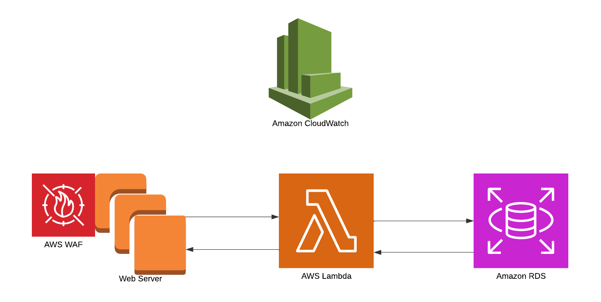

# CIS18-security-assessment-flow
Most small to medium businesses will generally have a simple website with the following components:

We want to get started with the client fast by mapping the components to <a href="https://www.cisecurity.org/controls/cis-controls-list" target="_blank">CIS 18 critical security controls</a> . This is safe to do as there are available mappings towards other regulatory and compliance frameworks.

#### Scenario Setup
Let us consider a more detailed ficitional business setup in order to do a elaborate assessment.

We have the following components:
1. AWS EC2 instances that host apache web servers.
2. AWS WAF to filter traffic to web servers.
3. AWS Lambda function that takes instructions from web servers.
4. AWS RDS database to store data.
5. AWS Cloudwatch service to log events.

###### CIS Control 1: Inventory and Control of Enterprise Assets
Inventory of Assets:
1. AWS EC2 instances
2. AWS WAF
3. AWS Lambda
4. AWS RDS
5. AWS Cloudwatch

###### CIS Control 2: Inventory and Control of Software Assets
Inventory of Software:
1. Apache web server software
2. Javascript/React frontend web application
3. Python scripts to execute as Lambda functions

###### CIS Control 3: Data Protection
We first categorize the data.
1. End user's authentication data and PII  
2. CloudWatch log data
3. App and system confguration data
Data Protection Controls:

***Note: The following will give you pointers. The security controls that get selected would depend on organizational contexts, budget, risk profile and risk appetite.
1. Maps to [OWASP A02:2021 – Cryptographic Failures](https://owasp.org/Top10/A02_2021-Cryptographic_Failures/), [OWASP A03:2021 – Injection](https://owasp.org/Top10/A03_2021-Injection/) and [OWASP A09:2021 – Security Logging and Monitoring Failures](https://owasp.org/Top10/A09_2021-Security_Logging_and_Monitoring_Failures/).
2. Make sure logs are tamper resistant. This maps to [A08:2021 – Software and Data Integrity Failures](https://owasp.org/Top10/A08_2021-Software_and_Data_Integrity_Failures/).

   
###### CIS Control 4: Secure Configuration of Enterprise Assets and Software
***Note: The following will give you pointers. The security controls that get selected would depend on organizational contexts, budget and risk profile and risk appetite.

1. AWS EC2 configurations i.e. IAM credentials, EC2 instance types and sizes. Maps to <a href="https://owasp.org/Top10/A05_2021-Security_Misconfiguration/" target="_blank">OWASP Top 10- A05:2021 – Security Misconfiguration.</a> Please also refer to [AWS EC2 best practices](https://docs.aws.amazon.com/AWSEC2/latest/UserGuide/ec2-best-practices.html).
2. AWS Lambda security configurations. Maps to [OWASP Serverless Top 10](https://owasp.org/www-project-serverless-top-10/), AWS Lambda security best practices[1](https://docs.aws.amazon.com/lambda/latest/dg/best-practices.html) and [2](https://docs.aws.amazon.com/lambda/latest/dg/lambda-security.html).
3. AWS RDS configuration maps to [Owasp Database Security Cheat Sheet](https://cheatsheetseries.owasp.org/cheatsheets/Database_Security_Cheat_Sheet.html) and [AWS best practices](https://aws.amazon.com/blogs/database/applying-best-practices-for-securing-sensitive-data-in-amazon-rds/).
4. Configure AWS WAF rules to protect against OWASP Top 10 and other rules based on the system context.

###### CIS Control 5: Account Management

1. AWS EC2, Lambda, CloudWatch depends on AWS IAM /AWS SSO(IAM Identity Center) for proper access control towards resources through IAM roles, lambda execution roles and ec2 instance profiles.
2. Maps to AWS IAM and IAM Identity Center best practices [1](https://docs.aws.amazon.com/IAM/latest/UserGuide/best-practices.html), [2](https://aws.amazon.com/iam/resources/best-practices/) and [3](https://aws.amazon.com/iam/resources/best-practices/).
3. Maps to [OWASP A07:2021 – Identification and Authentication Failures](https://owasp.org/Top10/A07_2021-Identification_and_Authentication_Failures/).

###### CIS Control 6: Access Control Management

1. AWS IAM policies must be defined with security best practices such least privilege, policy attributes/contexts such as time, source, vpc etc. and bind with IAM principles ensuring separation of duties.
2. Maps to [OWASP A01:2021 – Broken Access Control](https://owasp.org/Top10/A01_2021-Broken_Access_Control/).

###### CIS Control 7: Continuous Vulnerability Management

1. Consider using AWS services such as Amazon Inspector, AWS Secuity Hub, AWS GuardDuty and 3rd party tools such as OWASP ZAP, Burpsuite etc.
2. Actively investigate vulnerablilites found and take remediation steps if needed.
3. Integrate vulnerability checks in the testing and pre-deployment phase.
4. Maps to [OWASP A06:2021 – Vulnerable and Outdated Components](https://owasp.org/Top10/A06_2021-Vulnerable_and_Outdated_Components/), [OWASP A10:2021 – Server-Side Request Forgery (SSRF)](https://owasp.org/Top10/A10_2021-Server-Side_Request_Forgery_%28SSRF%29/), [OWASP A05:2021 – Security Misconfiguration](https://owasp.org/Top10/A05_2021-Security_Misconfiguration/), [OWASP A03:2021 – Injection](https://owasp.org/Top10/A03_2021-Injection/) and [OWASP A02:2021 – Cryptographic Failures](https://owasp.org/Top10/A02_2021-Cryptographic_Failures/).
